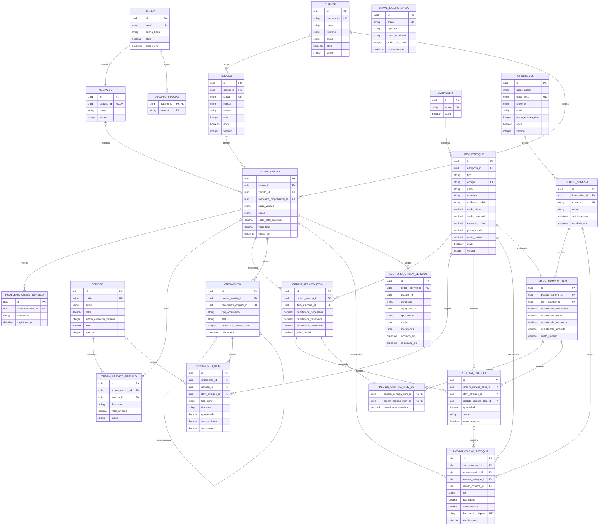

# Modelo Entidade-Relacionamento

Modelo logico revisado a partir da `main` atualizada em 22/08/2026. Consolida os sete contextos
refinados e as decisoes fechadas: Peças e Insumos separados nos fluxos, reserva para ambos os
tipos de item, Compras compartilhadas e trilha de auditoria da Ordem de Servico.

O modelo descreve entidades, atributos essenciais e cardinalidades. Tipos especificos do SGBD,
indices fisicos e nomes finais de colunas devem ser definidos nas migrations.

## Diagrama

## Dicionario de dados

`PK` identifica a chave primaria, `FK` a chave estrangeira e `UK` uma restricao de unicidade.
Status, tipos e unidades sao persistidos como `string`; seus valores permitidos sao validados no
dominio. `PECA` usa quantidade inteira; `INSUMO` admite fracao conforme a unidade de medida.

### Segurança

#### `USUARIO`

| Campo | Tipo | Chave ou regra |
|---|---|---|
| `id` | `uuid` | PK |
| `email` | `string` | Obrigatório e único; identificador de login |
| `senha_hash` | `string` | Obrigatório; hash BCrypt |
| `ativo` | `boolean` | Conta inativa não autentica |
| `criado_em` | `datetime` | Data de criação |

Relacionamentos: 1:N com `USUARIO_ESCOPO` e 1:1 com `MECANICO`.

#### `USUARIO_ESCOPO`

| Campo | Tipo | Chave ou regra |
|---|---|---|
| `usuario_id` | `uuid` | PK composta e FK para `USUARIO` |
| `escopo` | `string` | PK composta; escopo oficial do projeto |

### Mecânico

#### `MECANICO`

| Campo | Tipo | Chave ou regra |
|---|---|---|
| `id` | `uuid` | PK |
| `usuario_id` | `uuid` | FK única para `USUARIO` |
| `nome` | `string` | Obrigatório |
| `version` | `integer` | Controle otimista |

Relacionamentos: 1:1 com `USUARIO` e 1:N com `ORDEM_SERVICO`.

### Cliente e Veiculo

#### `CLIENTE`

| Campo | Tipo | Chave ou regra |
|---|---|---|
| `id` | `uuid` | PK |
| `nome` | `string` | Obrigatorio |
| `documento` | `string` | CPF ou CNPJ; unico entre clientes ativos |
| `tipo_documento` | `string` | `CPF` ou `CNPJ`, validado no dominio |
| `telefone` | `string` | Ao menos telefone ou e-mail, validado no dominio |
| `email` | `string` | Ao menos telefone ou e-mail, validado no dominio |
| `ativo` | `boolean` | Exclusao logica |
| `inativado_em` | `datetime` | Nulo enquanto ativo |
| `inativado_por` | `uuid` | Usuario responsavel |
| `version` | `integer` | Controle otimista |

Relacionamentos: 1:N com `VEICULO` e 1:N com `ORDEM_SERVICO`.

#### `VEICULO`

| Campo | Tipo | Chave ou regra |
|---|---|---|
| `id` | `uuid` | PK |
| `cliente_id` | `uuid` | FK para `CLIENTE`; proprietario atual |
| `placa` | `string` | Normalizada; unica entre veiculos ativos |
| `marca` | `string` | Obrigatoria |
| `modelo` | `string` | Obrigatorio |
| `ano` | `integer` | Faixa valida, incluindo limite dinamico do proximo ano, validada no dominio |
| `ativo` | `boolean` | Exclusao logica |
| `inativado_em` | `datetime` | Nulo enquanto ativo |
| `inativado_por` | `uuid` | Usuario responsavel |
| `motivo_inativacao` | `string` | Opcional |
| `version` | `integer` | Controle otimista |

Relacionamentos: N:1 com `CLIENTE` e 1:N com `ORDEM_SERVICO`. O MVP mantem apenas o
proprietario atual; nao existe historico de proprietarios.

### Ordem de Servico

#### `ORDEM_SERVICO`

| Campo | Tipo | Chave ou regra |
|---|---|---|
| `id` | `uuid` | PK |
| `cliente_id` | `uuid` | FK para `CLIENTE` |
| `veiculo_id` | `uuid` | FK para `VEICULO` |
| `mecanico_responsavel_id` | `uuid` | FK opcional para `MECANICO` |
| `placa_veiculo` | `string` | Fotografia da placa na abertura |
| `status` | `string` | Nove estados definidos para o fluxo, validados no dominio |
| `custo_total_materiais` | `decimal` | Acumulado pelas saidas de estoque |
| `valor_final` | `decimal` | Registrado na entrega |
| `criada_em` | `datetime` | Abertura |
| `iniciada_em` | `datetime` | Inicio da execucao; opcional |
| `finalizada_em` | `datetime` | Finalizacao; opcional |
| `observacoes_finalizacao` | `string` | Opcional |
| `entregue_em` | `datetime` | Entrega; opcional |
| `cliente_retirada_id` | `uuid` | FK opcional para `CLIENTE` |
| `responsavel_entrega_id` | `uuid` | Usuario responsavel |
| `observacoes_entrega` | `string` | Opcional |

Relacionamentos: N:1 com cliente, veiculo e mecanico responsavel; 1:N com problemas, servicos, materiais, orcamentos,
movimentacoes e registros de auditoria.

#### `PROBLEMA_ORDEM_SERVICO`

| Campo | Tipo | Chave ou regra |
|---|---|---|
| `id` | `uuid` | PK |
| `ordem_servico_id` | `uuid` | FK para `ORDEM_SERVICO` |
| `descricao` | `string` | Obrigatoria |
| `registrado_em` | `datetime` | Distingue relatado de encontrado pelo momento do fluxo |

Relacionamento: N:1 com `ORDEM_SERVICO`. Nao ha tipo proprio de problema no modelo consolidado.

#### `ORDEM_SERVICO_SERVICO`

| Campo | Tipo | Chave ou regra |
|---|---|---|
| `id` | `uuid` | PK |
| `ordem_servico_id` | `uuid` | FK para `ORDEM_SERVICO` |
| `servico_id` | `uuid` | FK para `SERVICO` |
| `descricao` | `string` | Fotografia do catalogo |
| `valor_unitario` | `decimal` | Fotografia do preco |
| `status` | `string` | Necessario, em execucao ou concluido |

Relacionamento: tabela associativa entre `ORDEM_SERVICO` e `SERVICO`.

#### `ORDEM_SERVICO_ITEM`

| Campo | Tipo | Chave ou regra |
|---|---|---|
| `id` | `uuid` | PK |
| `ordem_servico_id` | `uuid` | FK para `ORDEM_SERVICO` |
| `item_estoque_id` | `uuid` | FK para `ITEM_ESTOQUE` |
| `quantidade_necessaria` | `decimal` | Maior que zero |
| `quantidade_reservada` | `decimal` | Controle do compromisso de estoque |
| `quantidade_consumida` | `decimal` | Acumulada nas saidas |
| `valor_unitario` | `decimal` | Preco de peca ou custo de insumo no atendimento |

Relacionamentos: N:1 com OS e item de estoque; 1:N com `RESERVA_ESTOQUE`; N:N com linhas de
pedido por `PEDIDO_COMPRA_ITEM_OS`.

#### `AUDITORIA_ORDEM_SERVICO`

| Campo | Tipo | Chave ou regra |
|---|---|---|
| `id` | `uuid` | PK |
| `ordem_servico_id` | `uuid` | FK para `ORDEM_SERVICO` |
| `usuario_id` | `uuid` | FK para `USUARIO`; ator autenticado |
| `agregado` | `string` | Agregado relacionado |
| `agregado_id` | `uuid` | Identificador do agregado |
| `tipo_evento` | `string` | Acao auditada |
| `dados` | `json` | Dados da acao |
| `metadados` | `json` | Contexto tecnico e autoria |
| `ocorrido_em` | `datetime` | Quando a acao ocorreu |
| `registrado_em` | `datetime` | Quando a trilha foi gravada |

Relacionamento: N:1 com `ORDEM_SERVICO`. E a fonte do campo `eventos` da consulta de detalhe;
nao representa mensageria.

### Catalogos e Orcamento

#### `SERVICO`

| Campo | Tipo | Chave ou regra |
|---|---|---|
| `id` | `uuid` | PK |
| `codigo` | `string` | UK; gerado no formato `SER-000001` |
| `nome` | `string` | Obrigatorio |
| `nome_normalizado` | `string` | Unico entre servicos ativos |
| `descricao` | `string` | Opcional |
| `valor` | `decimal` | Maior ou igual a zero |
| `tempo_estimado_minutos` | `integer` | Minimo de um minuto |
| `ativo` | `boolean` | Exclusao logica |
| `data_desativacao` | `datetime` | Nulo enquanto ativo |
| `usuario_desativacao` | `uuid` | Usuario responsavel |
| `data_criacao` | `datetime` | Imutavel |
| `version` | `integer` | Controle otimista |

Relacionamentos: 1:N com `ORDEM_SERVICO_SERVICO` e 0:N com `ORCAMENTO_ITEM`.

#### `CATEGORIA`

| Campo | Tipo | Chave ou regra |
|---|---|---|
| `id` | `uuid` | PK |
| `nome` | `string` | UK |
| `ativa` | `boolean` | Controle de uso no catalogo |

Relacionamento: 1:N com `ITEM_ESTOQUE`.

#### `ORCAMENTO`

| Campo | Tipo | Chave ou regra |
|---|---|---|
| `id` | `uuid` | PK |
| `ordem_servico_id` | `uuid` | FK para `ORDEM_SERVICO` |
| `orcamento_original_id` | `uuid` | FK opcional para o principal |
| `tipo_orcamento` | `string` | `PRINCIPAL` ou `COMPLEMENTAR`, validado no dominio |
| `status` | `string` | `CRIADO`, `APROVADO` ou `RECUSADO`, validado no dominio |
| `estimativa_entrega_dias` | `integer` | Calculada |
| `criado_em` | `datetime` | — |
| `aprovado_em` | `datetime` | Opcional |
| `recusado_em` | `datetime` | Opcional |
| `data_atualizacao` | `datetime` | — |

Relacionamentos: N:1 com OS; autorrelacionamento para complementar; 1:N com `ORCAMENTO_ITEM`.
Existe um unico orcamento principal por OS; complementar referencia o principal da mesma OS.

#### `ORCAMENTO_ITEM`

| Campo | Tipo | Chave ou regra |
|---|---|---|
| `id` | `uuid` | PK |
| `orcamento_id` | `uuid` | FK para `ORCAMENTO` |
| `servico_id` | `uuid` | FK opcional para `SERVICO` |
| `item_estoque_id` | `uuid` | FK opcional para `ITEM_ESTOQUE` |
| `tipo_item` | `string` | `SERVICO`, `PECA` ou `INSUMO`, validado no dominio |
| `descricao` | `string` | Fotografia do item |
| `quantidade` | `decimal` | Maior que zero |
| `valor_unitario` | `decimal` | Fotografia do valor |
| `valor_total` | `decimal` | `quantidade x valor_unitario` |

Relacionamento: N:1 com orcamento; referencia exatamente um de `SERVICO` ou `ITEM_ESTOQUE`.

### Estoque e Compras

#### `ITEM_ESTOQUE`

| Campo | Tipo | Chave ou regra |
|---|---|---|
| `id` | `uuid` | PK |
| `categoria_id` | `uuid` | FK para `CATEGORIA` |
| `tipo` | `string` | `PECA` ou `INSUMO`, validado no dominio |
| `codigo` | `string` | UK; `PEC-000001` ou `INS-000001` |
| `nome` | `string` | Obrigatorio |
| `descricao` | `string` | Obrigatoria |
| `descricao_normalizada` | `string` | Regra de duplicidade por tipo |
| `fabricante` | `string` | Aplicavel a peca |
| `unidade_medida` | `string` | Obrigatoria; validada no dominio; permite fracao para insumo |
| `saldo_fisico` | `decimal` | Saldo em prateleira |
| `saldo_reservado` | `decimal` | Saldo comprometido com OS |
| `estoque_minimo` | `decimal` | Ponto de reposicao |
| `preco_venda` | `decimal` | Aplicavel a peca |
| `custo_unitario` | `decimal` | Aplicavel a insumo; ultimo custo de entrada |
| `ativo` | `boolean` | Exclusao logica |
| `data_desativacao` | `datetime` | Nulo enquanto ativo |
| `usuario_desativacao` | `uuid` | Usuario responsavel |
| `version` | `integer` | Controle otimista |

Relacionamentos: N:1 com categoria; 1:N com itens da OS, itens de orcamento, reservas,
movimentacoes e itens de pedido. `saldo_disponivel` e derivado de `saldo_fisico - saldo_reservado`.

#### `RESERVA_ESTOQUE`

| Campo | Tipo | Chave ou regra |
|---|---|---|
| `id` | `uuid` | PK |
| `ordem_servico_item_id` | `uuid` | FK para `ORDEM_SERVICO_ITEM` |
| `item_estoque_id` | `uuid` | FK para `ITEM_ESTOQUE` |
| `pedido_compra_item_id` | `uuid` | FK opcional para `PEDIDO_COMPRA_ITEM` |
| `quantidade` | `decimal` | Maior que zero |
| `status` | `string` | `ATIVA`, `CONSUMIDA` ou `LIBERADA`, validado no dominio |
| `reservada_em` | `datetime` | — |
| `liberada_em` | `datetime` | Opcional |

Relacionamentos: N:1 com item da OS e item de estoque. Pode estar associada a uma compra pendente;
uma reserva vale tanto para peca quanto para insumo.

#### `MOVIMENTACAO_ESTOQUE`

| Campo | Tipo | Chave ou regra |
|---|---|---|
| `id` | `uuid` | PK |
| `item_estoque_id` | `uuid` | FK para `ITEM_ESTOQUE` |
| `ordem_servico_id` | `uuid` | FK opcional para `ORDEM_SERVICO` |
| `reserva_estoque_id` | `uuid` | FK opcional para `RESERVA_ESTOQUE` |
| `pedido_compra_id` | `uuid` | FK opcional para `PEDIDO_COMPRA` |
| `tipo` | `string` | Entrada, reserva, liberacao, saida ou retorno, validado no dominio |
| `quantidade` | `decimal` | Maior que zero |
| `custo_unitario` | `decimal` | Custo da entrada ou saida |
| `documento_origem` | `string` | UK quando aplicavel ao recebimento |
| `ocorrida_em` | `datetime` | — |

Relacionamentos: N:1 com item de estoque e referencias opcionais a OS, reserva e pedido. E um
historico imutavel e a origem dos saldos correntes.

#### `FORNECEDOR`

| Campo | Tipo | Chave ou regra |
|---|---|---|
| `id` | `uuid` | PK |
| `razao_social` | `string` | Obrigatoria |
| `nome_fantasia` | `string` | Opcional |
| `documento` | `string` | CPF ou CNPJ; unico entre ativos e imutavel |
| `tipo_documento` | `string` | `CPF` ou `CNPJ`, validado no dominio |
| `telefone` | `string` | Ao menos telefone ou e-mail, validado no dominio |
| `email` | `string` | Ao menos telefone ou e-mail, validado no dominio |
| `prazo_entrega_dias` | `integer` | Padrao de sete dias quando ausente |
| `ativo` | `boolean` | Exclusao logica |
| `inativado_em` | `datetime` | Nulo enquanto ativo |
| `inativado_por` | `uuid` | Usuario responsavel |
| `data_criacao` | `datetime` | Imutavel |
| `data_atualizacao` | `datetime` | Alterada a cada atualizacao |
| `usuario_atualizacao` | `uuid` | Usuario responsavel pela ultima atualizacao |
| `version` | `integer` | Controle otimista |

Relacionamento: 1:N com `PEDIDO_COMPRA`. Pertence a Peças e e referenciado por Insumos.

#### `PEDIDO_COMPRA`

| Campo | Tipo | Chave ou regra |
|---|---|---|
| `id` | `uuid` | PK |
| `fornecedor_id` | `uuid` | FK para `FORNECEDOR` |
| `numero` | `string` | UK; sequencial funcional |
| `status` | `string` | `ABERTO`, `PARCIAL`, `CONCLUIDO` ou `CANCELADO`, validado no dominio |
| `solicitado_em` | `datetime` | — |
| `recebido_em` | `datetime` | Opcional |

Relacionamentos: N:1 com fornecedor; 1:N com `PEDIDO_COMPRA_ITEM`; 0:N com movimentacoes.
O pedido pode conter pecas e insumos.

#### `PEDIDO_COMPRA_ITEM`

| Campo | Tipo | Chave ou regra |
|---|---|---|
| `id` | `uuid` | PK |
| `pedido_compra_id` | `uuid` | FK para `PEDIDO_COMPRA` |
| `item_estoque_id` | `uuid` | FK para `ITEM_ESTOQUE` |
| `quantidade_necessaria` | `decimal` | Demanda apurada nas OS |
| `quantidade_pedida` | `decimal` | Deve cobrir a demanda necessaria, validado no dominio |
| `quantidade_reservada` | `decimal` | Parcela comprometida com as OS |
| `quantidade_recebida` | `decimal` | Acumulada nos recebimentos |
| `custo_unitario` | `decimal` | Ultimo custo recebido |

Relacionamentos: N:1 com pedido e item de estoque; N:N com itens da OS por
`PEDIDO_COMPRA_ITEM_OS`; 0:N com reservas de compra.

#### `PEDIDO_COMPRA_ITEM_OS`

| Campo | Tipo | Chave ou regra |
|---|---|---|
| `pedido_compra_item_id` | `uuid` | PK, FK para `PEDIDO_COMPRA_ITEM` |
| `ordem_servico_item_id` | `uuid` | PK, FK para `ORDEM_SERVICO_ITEM` |
| `quantidade_atendida` | `decimal` | Maior que zero |

Relacionamento: tabela associativa entre a linha de compra e as necessidades de materiais das OS.

### Controle Tecnico

#### `CHAVE_IDEMPOTENCIA`

| Campo | Tipo | Chave ou regra |
|---|---|---|
| `id` | `uuid` | PK |
| `chave` | `string` | UK |
| `operacao` | `string` | Operacao de saldo protegida |
| `hash_requisicao` | `string` | Detecta reuso indevido da chave |
| `status_resposta` | `integer` | Resposta devolvida na repeticao |
| `processada_em` | `datetime` | — |

Relacionamento: registro tecnico sem FK de dominio. E obrigatorio em toda operacao que movimenta
saldo: reserva, compra, entrada, saida e devolucao.

## Restricoes essenciais para as migrations

- `VEICULO.cliente_id` e obrigatorio; nao ha veiculo sem proprietario nem historico de donos no MVP.
- `ORDEM_SERVICO` deve usar cliente e veiculo vinculados na abertura e guardar a placa como
  fotografia historica.
- `ITEM_ESTOQUE` centraliza a persistencia de pecas e insumos; `tipo` diferencia suas regras e
  deve ser coerente com campos e quantidades aplicaveis.
- `ORCAMENTO_ITEM` deve referenciar exatamente um de `SERVICO` ou `ITEM_ESTOQUE`.
- Criar unicidade parcial para cadastros ativos: documento de cliente e fornecedor, placa de veiculo,
  nome normalizado de servico e as chaves de duplicidade de peca e insumo definidas nos resumos.
- `saldo_reservado` nunca pode ser negativo e `saldo_disponivel` nao deve ser persistido, pois e
  derivado de `saldo_fisico - saldo_reservado`.
- Movimentacoes, reservas, pedido e atualizacao de saldo devem ocorrer na mesma transacao, com lock
  de linha ordenado por `item_estoque_id`.
